# Machine Learning Utilizing scikit-learn and tensorflow + Deep Learning  in Python with TensorFlow and Keras

___

#### Farnam Adelkhani, April 2019

___

**Jupyter Notebook Viewer Links: **

**Intro to Machine Learning Utilizing scikit-learn and tensorflow:**
https://nbviewer.jupyter.org/github/FarnamAdelkhani/introMachineLearning/blob/master/introML.ipynb

**Deep Learning in Python with TensorFlow and Keras:**
https://nbviewer.jupyter.org/github/FarnamAdelkhani/introMachineLearning/blob/master/Deep%20Learning%20with%20TensorFlow%20and%20Keras.ipynb

___

# Machine Learning Utilizing scikit-learn and tensorflow

**Write one program that can solve many problems, learn from examples and experiences.**

Write code to tell the difference between an Apple and an Orange.
    What if photos are black and white... or no apple/orange in photo?
        We'd need a new program and/or tons of rules!
    What is better than this?
        Create a classifier: Function, takes data as input
        
Supervised learning: the act of creating classifiers
    ... think of a classifier as a box of rules.

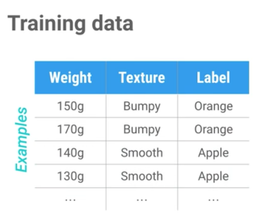


```python
import sklearn
# First 2 columns
features = [[140, "smooth"], [130, "smooth"], [150, "bumpy"], [170, "bumpy"]]
# Last column
labels = ["apple", "apple", "orange", "orange",]

# ---------------------------------------------------------- #

# Change the variable types from string to int
import sklearn
# 0=bumpy  &  1=smooth
features = [[140, 1], [130, 1], [150, 0], [170, 0]]
# 0=apple  &  1=orange
labels = [0, 0, 1, 1]
```


```python
# Train a classifier, in this case: a decision tree
# Now we can just change the training data, rather than rewriting the func

from sklearn import tree
# 0=bumpy  &  1=smooth
features = [[140, 1], [130, 1], [150, 0], [170, 0]]
# 0=apple  &  1=orange
labels = [0, 0, 1, 1]
clf = tree.DecisionTreeClassifier()
# fit = synonym for 'find patterns in data'
clf = clf.fit(features, labels)

print(clf.predict([[150, 0]]))
# Output will be 0=apple & 1=orange
```

    [1]


```python
# Utilizing iris - the dataset includes table from wikipedia and metadata

from sklearn.datasets import load_iris
iris = load_iris()

# Metadata tells us names of features and names of flower types
print(iris.feature_names)
print(iris.target_names)
print(iris.data[0])

print(iris.target[0])
# Label of 0 means it is a setosa

# To iterate over all 150 entries
for i in range(len(iris.target)):
    print("Example %d: label %s, features %s" % (i, iris.target[i], iris.data[i]))
```

    ['sepal length (cm)', 'sepal width (cm)', 'petal length (cm)', 'petal width (cm)']
    ['setosa' 'versicolor' 'virginica']
    [5.1 3.5 1.4 0.2]
    0
    Example 0: label 0, features [5.1 3.5 1.4 0.2]
    Example 1: label 0, features [4.9 3.  1.4 0.2]
    Example 2: label 0, features [4.7 3.2 1.3 0.2]
    Example 3: label 0, features [4.6 3.1 1.5 0.2]
    Example 4: label 0, features [5.  3.6 1.4 0.2]
    Example 5: label 0, features [5.4 3.9 1.7 0.4]
    Example 6: label 0, features [4.6 3.4 1.4 0.3]
    Example 7: label 0, features [5.  3.4 1.5 0.2]
    Example 8: label 0, features [4.4 2.9 1.4 0.2]
    Example 9: label 0, features [4.9 3.1 1.5 0.1]
    Example 10: label 0, features [5.4 3.7 1.5 0.2]
    Example 11: label 0, features [4.8 3.4 1.6 0.2]
    Example 12: label 0, features [4.8 3.  1.4 0.1]
    Example 13: label 0, features [4.3 3.  1.1 0.1]
    Example 14: label 0, features [5.8 4.  1.2 0.2]
    Example 15: label 0, features [5.7 4.4 1.5 0.4]
    Example 16: label 0, features [5.4 3.9 1.3 0.4]
    Example 17: label 0, features [5.1 3.5 1.4 0.3]
    Example 18: label 0, features [5.7 3.8 1.7 0.3]
    Example 19: label 0, features [5.1 3.8 1.5 0.3]
    Example 20: label 0, features [5.4 3.4 1.7 0.2]
    Example 21: label 0, features [5.1 3.7 1.5 0.4]
    Example 22: label 0, features [4.6 3.6 1.  0.2]
    Example 23: label 0, features [5.1 3.3 1.7 0.5]
    Example 24: label 0, features [4.8 3.4 1.9 0.2]
    Example 25: label 0, features [5.  3.  1.6 0.2]
    Example 26: label 0, features [5.  3.4 1.6 0.4]
    Example 27: label 0, features [5.2 3.5 1.5 0.2]
    Example 28: label 0, features [5.2 3.4 1.4 0.2]
    Example 29: label 0, features [4.7 3.2 1.6 0.2]
    Example 30: label 0, features [4.8 3.1 1.6 0.2]
    Example 31: label 0, features [5.4 3.4 1.5 0.4]
    Example 32: label 0, features [5.2 4.1 1.5 0.1]
    Example 33: label 0, features [5.5 4.2 1.4 0.2]
    Example 34: label 0, features [4.9 3.1 1.5 0.2]
    Example 35: label 0, features [5.  3.2 1.2 0.2]
    Example 36: label 0, features [5.5 3.5 1.3 0.2]
    Example 37: label 0, features [4.9 3.6 1.4 0.1]
    Example 38: label 0, features [4.4 3.  1.3 0.2]
    Example 39: label 0, features [5.1 3.4 1.5 0.2]
    Example 40: label 0, features [5.  3.5 1.3 0.3]
    Example 41: label 0, features [4.5 2.3 1.3 0.3]
    Example 42: label 0, features [4.4 3.2 1.3 0.2]
    Example 43: label 0, features [5.  3.5 1.6 0.6]
    Example 44: label 0, features [5.1 3.8 1.9 0.4]
    Example 45: label 0, features [4.8 3.  1.4 0.3]
    Example 46: label 0, features [5.1 3.8 1.6 0.2]
    Example 47: label 0, features [4.6 3.2 1.4 0.2]
    Example 48: label 0, features [5.3 3.7 1.5 0.2]
    Example 49: label 0, features [5.  3.3 1.4 0.2]
    Example 50: label 1, features [7.  3.2 4.7 1.4]
    Example 51: label 1, features [6.4 3.2 4.5 1.5]
    Example 52: label 1, features [6.9 3.1 4.9 1.5]
    Example 53: label 1, features [5.5 2.3 4.  1.3]
    Example 54: label 1, features [6.5 2.8 4.6 1.5]
    Example 55: label 1, features [5.7 2.8 4.5 1.3]
    Example 56: label 1, features [6.3 3.3 4.7 1.6]
    Example 57: label 1, features [4.9 2.4 3.3 1. ]
    Example 58: label 1, features [6.6 2.9 4.6 1.3]
    Example 59: label 1, features [5.2 2.7 3.9 1.4]
    Example 60: label 1, features [5.  2.  3.5 1. ]
    Example 61: label 1, features [5.9 3.  4.2 1.5]
    Example 62: label 1, features [6.  2.2 4.  1. ]
    Example 63: label 1, features [6.1 2.9 4.7 1.4]
    Example 64: label 1, features [5.6 2.9 3.6 1.3]
    Example 65: label 1, features [6.7 3.1 4.4 1.4]
    Example 66: label 1, features [5.6 3.  4.5 1.5]
    Example 67: label 1, features [5.8 2.7 4.1 1. ]
    Example 68: label 1, features [6.2 2.2 4.5 1.5]
    Example 69: label 1, features [5.6 2.5 3.9 1.1]
    Example 70: label 1, features [5.9 3.2 4.8 1.8]
    Example 71: label 1, features [6.1 2.8 4.  1.3]
    Example 72: label 1, features [6.3 2.5 4.9 1.5]
    Example 73: label 1, features [6.1 2.8 4.7 1.2]
    Example 74: label 1, features [6.4 2.9 4.3 1.3]
    Example 75: label 1, features [6.6 3.  4.4 1.4]
    Example 76: label 1, features [6.8 2.8 4.8 1.4]
    Example 77: label 1, features [6.7 3.  5.  1.7]
    Example 78: label 1, features [6.  2.9 4.5 1.5]
    Example 79: label 1, features [5.7 2.6 3.5 1. ]
    Example 80: label 1, features [5.5 2.4 3.8 1.1]
    Example 81: label 1, features [5.5 2.4 3.7 1. ]
    Example 82: label 1, features [5.8 2.7 3.9 1.2]
    Example 83: label 1, features [6.  2.7 5.1 1.6]
    Example 84: label 1, features [5.4 3.  4.5 1.5]
    Example 85: label 1, features [6.  3.4 4.5 1.6]
    Example 86: label 1, features [6.7 3.1 4.7 1.5]
    Example 87: label 1, features [6.3 2.3 4.4 1.3]
    Example 88: label 1, features [5.6 3.  4.1 1.3]
    Example 89: label 1, features [5.5 2.5 4.  1.3]
    Example 90: label 1, features [5.5 2.6 4.4 1.2]
    Example 91: label 1, features [6.1 3.  4.6 1.4]
    Example 92: label 1, features [5.8 2.6 4.  1.2]
    Example 93: label 1, features [5.  2.3 3.3 1. ]
    Example 94: label 1, features [5.6 2.7 4.2 1.3]
    Example 95: label 1, features [5.7 3.  4.2 1.2]
    Example 96: label 1, features [5.7 2.9 4.2 1.3]
    Example 97: label 1, features [6.2 2.9 4.3 1.3]
    Example 98: label 1, features [5.1 2.5 3.  1.1]
    Example 99: label 1, features [5.7 2.8 4.1 1.3]
    Example 100: label 2, features [6.3 3.3 6.  2.5]
    Example 101: label 2, features [5.8 2.7 5.1 1.9]
    Example 102: label 2, features [7.1 3.  5.9 2.1]
    Example 103: label 2, features [6.3 2.9 5.6 1.8]
    Example 104: label 2, features [6.5 3.  5.8 2.2]
    Example 105: label 2, features [7.6 3.  6.6 2.1]
    Example 106: label 2, features [4.9 2.5 4.5 1.7]
    Example 107: label 2, features [7.3 2.9 6.3 1.8]
    Example 108: label 2, features [6.7 2.5 5.8 1.8]
    Example 109: label 2, features [7.2 3.6 6.1 2.5]
    Example 110: label 2, features [6.5 3.2 5.1 2. ]
    Example 111: label 2, features [6.4 2.7 5.3 1.9]
    Example 112: label 2, features [6.8 3.  5.5 2.1]
    Example 113: label 2, features [5.7 2.5 5.  2. ]
    Example 114: label 2, features [5.8 2.8 5.1 2.4]
    Example 115: label 2, features [6.4 3.2 5.3 2.3]
    Example 116: label 2, features [6.5 3.  5.5 1.8]
    Example 117: label 2, features [7.7 3.8 6.7 2.2]
    Example 118: label 2, features [7.7 2.6 6.9 2.3]
    Example 119: label 2, features [6.  2.2 5.  1.5]
    Example 120: label 2, features [6.9 3.2 5.7 2.3]
    Example 121: label 2, features [5.6 2.8 4.9 2. ]
    Example 122: label 2, features [7.7 2.8 6.7 2. ]
    Example 123: label 2, features [6.3 2.7 4.9 1.8]
    Example 124: label 2, features [6.7 3.3 5.7 2.1]
    Example 125: label 2, features [7.2 3.2 6.  1.8]
    Example 126: label 2, features [6.2 2.8 4.8 1.8]
    Example 127: label 2, features [6.1 3.  4.9 1.8]
    Example 128: label 2, features [6.4 2.8 5.6 2.1]
    Example 129: label 2, features [7.2 3.  5.8 1.6]
    Example 130: label 2, features [7.4 2.8 6.1 1.9]
    Example 131: label 2, features [7.9 3.8 6.4 2. ]
    Example 132: label 2, features [6.4 2.8 5.6 2.2]
    Example 133: label 2, features [6.3 2.8 5.1 1.5]
    Example 134: label 2, features [6.1 2.6 5.6 1.4]
    Example 135: label 2, features [7.7 3.  6.1 2.3]
    Example 136: label 2, features [6.3 3.4 5.6 2.4]
    Example 137: label 2, features [6.4 3.1 5.5 1.8]
    Example 138: label 2, features [6.  3.  4.8 1.8]
    Example 139: label 2, features [6.9 3.1 5.4 2.1]
    Example 140: label 2, features [6.7 3.1 5.6 2.4]
    Example 141: label 2, features [6.9 3.1 5.1 2.3]
    Example 142: label 2, features [5.8 2.7 5.1 1.9]
    Example 143: label 2, features [6.8 3.2 5.9 2.3]
    Example 144: label 2, features [6.7 3.3 5.7 2.5]
    Example 145: label 2, features [6.7 3.  5.2 2.3]
    Example 146: label 2, features [6.3 2.5 5.  1.9]
    Example 147: label 2, features [6.5 3.  5.2 2. ]
    Example 148: label 2, features [6.2 3.4 5.4 2.3]
    Example 149: label 2, features [5.9 3.  5.1 1.8]


```python
# Train a classifier - 1st split the data

import numpy as np
from sklearn.datasets import load_iris
from sklearn import tree

iris = load_iris()
test_idx = [0,50,100]

# Training data:
train_target = np.delete(iris.target, test_idx)
train_data = np.delete(iris.data, test_idx, axis=0)

# Testing data: (Just contains examples that were removed)
test_target = iris.target[test_idx]
test_data = iris.data[test_idx]

# Import classifier and train on data
clf = tree.DecisionTreeClassifier()
clf.fit(train_data, train_target)

print(test_target)
print(clf.predict(test_data))
# If predicted labels match testing data = that means all is correct
```

    [0 1 2]
    [0 1 2]


```python
# Visualize the tree to see how classifier works.

from sklearn.externals.six import StringIO
import pydot
dot_data = StringIO()
tree.export_graphviz(clf,
                        out_file=dot_data,
                        feature_names=iris.feature_names,
                        class_names=iris.target_names,
                        filled=True, rounded=True,
                        impurity=False)

graph = pydot.graph_from_dot_data(dot_data.getvalue())
graph[0].write_pdf("iris.pdf") 

# Use this format to run terminal commands in Jupyter Notebook
! open -a preview iris.pdf
```

Output from cell above:
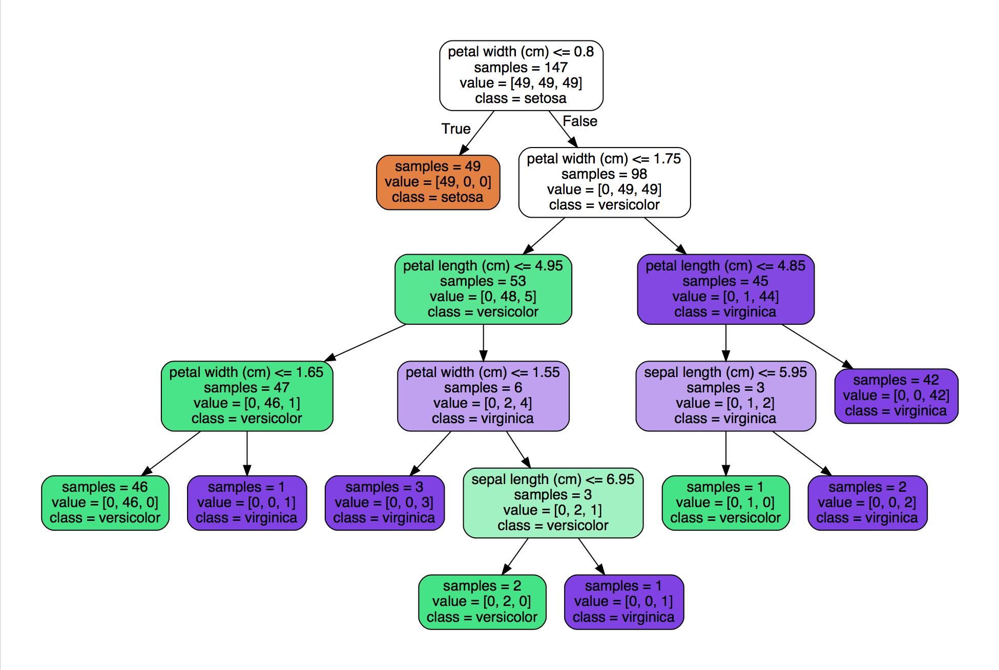


```python
# Change 0-->1 to test second example.
print(test_data[0], test_target[0])
print(test_data[1], test_target[1])
print(test_data[2], test_target[2])

print(iris.feature_names, iris.target_names)

# Next up... how decision trees are automatically generated from examples.
```

    [5.1 3.5 1.4 0.2] 0
    [7.  3.2 4.7 1.4] 1
    [6.3 3.3 6.  2.5] 2
    ['sepal length (cm)', 'sepal width (cm)', 'petal length (cm)', 'petal width (cm)'] ['setosa' 'versicolor' 'virginica']


<pre>Classifiers are only as good as the features you provide!
Therefor, providing good features is critical.

IE: In a binary classifier, 0/1 should represent clearly defined differences.</pre>


```python
import numpy as np
import matplotlib.pyplot as plt

greyhounds = 500
labs = 500

# Average height of dog +/- 4 inches
grey_height = 28 + 4 * np.random.randn(greyhounds)
lab_height = 24 + 4 * np.random.randn(labs)

# greyHounds=red & labs=blue
plt.hist([grey_height, lab_height], stacked=True, color=['r','b'])
plt.show()

! python
```


    <Figure size 640x480 with 1 Axes>


    Python 3.7.1 (default, Dec 14 2018, 13:28:58) 
    [Clang 4.0.1 (tags/RELEASE_401/final)] :: Anaconda, Inc. on darwin
    Type "help", "copyright", "credits" or "license" for more information.
    >>> 

<pre>From the output of the prior cell:
- Depending on the height of the dog, it is possible to make an accurate prediction, if the feature data is relevant.
- Towards the middle of the graph, it is not possible to make a useful prediction, since the probabilities are roughly equal.
- Adding more features, which are useful, would be a good idea.
    ie: eye color may not correlate with type of dog.
- Maintain independent features, ie: don't include height in cm and inch.
</pre>

Let's write a pipeline for supervised learning.
- How multiple classifiers can solve the same problem.
- What does it mean for an algorithm to learn something from data?


```python
# Import a dataset
from sklearn import datasets
iris = datasets.load_iris()

# Feature--> f(x)=y <--Label
X = iris.data
y = iris.target

# Import the data, then partition into 1. _train and 2. _test
from sklearn.model_selection import train_test_split
X_train, X_test, y_train, y_test = train_test_split(X, y, test_size = .5)

# Creating the classifier - Note: Only 2 lines of code are classifier specific
from sklearn import tree
my_classifier = tree.DecisionTreeClassifier()

# Use training data on classifier
my_classifier.fit(X_train, y_train)

# Use predict method to classify test data
predictions = my_classifier.predict(X_test)
print(predictions)

# To find accuracy, compare predicted labels to true values
from sklearn.metrics import accuracy_score
# In this case, accuracy should be ~%90
print(accuracy_score(y_test, predictions))
```


```python
# *Using a different classifier, KNeighbor* - Otherwise the same.
# Note: the accuracy may be higher since this classifer works differently.
# In my case, went from: 0.906 -> 0.946 accuracy.

# Import a dataset
from sklearn import datasets
iris = datasets.load_iris()

# Feature--> f(x)=y <--Label
X = iris.data
y = iris.target

# Import the data, then partition into 1. _train and 2. _test
from sklearn.model_selection import train_test_split
X_train, X_test, y_train, y_test = train_test_split(X, y, test_size = .5)

# Utilizing KNeighbor classifier this time...
from sklearn.neighbors import KNeighborsClassifier
my_classifier = KNeighborsClassifier()

# Use training data on classifier
my_classifier.fit(X_train, y_train)

# Use predict method to classify test data
predictions = my_classifier.predict(X_test)
print(predictions)

# To find accuracy, compare predicted labels to true values
from sklearn.metrics import accuracy_score
# In this case, accuracy should be ~%90
print(accuracy_score(y_test, predictions))
```

### Take away from prior cells: Although there are different types of classifiers, they can be implemented in the same way.

<pre>In programming, we define a function as:

    def classify(features):
        # do some logic
        return label

*In supervised learning we do NOT want to write this function.
    ... we want an algorithm to learn it from training data.</pre>

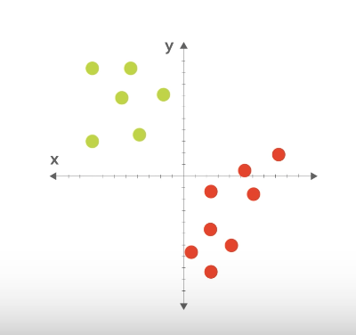

Pretend you want to distinguish between the red and green dots.
- Just use 2 features: X and Y coordinate of the dot.

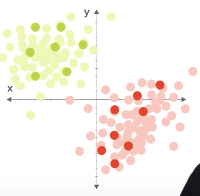
How can we predict these dots which were not in our training data.

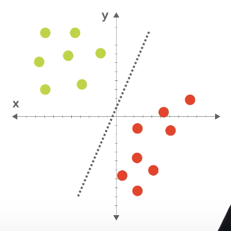
Let's draw a line and say all dots to either side are red or green.

Approach: Use training data to adjust the parameters of the model.

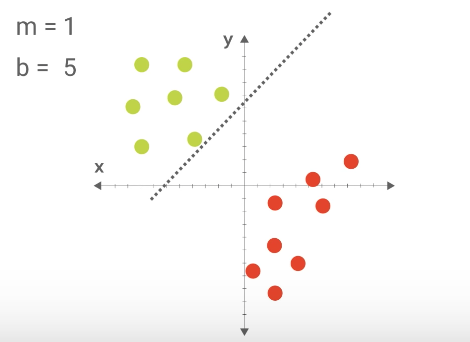
By adjusting the parameters of m and b, we can move the line as we learn the correct parameters.

Important: As we introduce each new dot, we can adjust the parameters of a model. 
- If the model gets it correct, no need to make changes.
- If the model gets it wrong, adjust the parameters of the model. Then move on to the next one.

Take away: One way to think of learning is to use training data to adjust the parameters of a model.

### Writing our first classifier from scratch
Will be similar to KNearestNeighbors classifier (One of the most basic classifiers)


```python
# Previously we imported the classifier from a library.
# ... this time, we will write our own.

import random

# Implement a class for our classifier:
class ScrappyKNN():
    def fit(self, X_train, y_train):
        # Store the training data in this class.
        self.X_train = X_train
        self.y_train = y_train
    
    def predict(self, X_test):
        predicitons = []
        for row in X_test:
            label = random.choice(self.y_train)
            predictions.append(label)
        
        return predictions

# Import a dataset
from sklearn import datasets
iris = datasets.load_iris()

# Feature--> f(x)=y <--Label
X = iris.data
y = iris.target

# Import the data, then partition into 1. _train and 2. _test
from sklearn.model_selection import train_test_split
X_train, X_test, y_train, y_test = train_test_split(X, y, test_size = .5)

# Comment out our classifier and write our own...
# from sklearn.neighbors import KNeighborsClassifier

# Change our pipeline to use our new classifier
# my_classifier = KNeighborsClassifier()
my_classifier = ScrappyKNN()

# Use training data on classifier
my_classifier.fit(X_train, y_train)

# Use predict method to classify test data
# predictions = my_classifier.predict(X_test)
# print(predictions)

# To find accuracy, compare predicted labels to true values
from sklearn.metrics import accuracy_score
# In this case, accuracy should be ~%90
print(accuracy_score(y_test, predictions))
```

In the example above, we acheive an accuracy of ~30%... let's try to improve upon this...

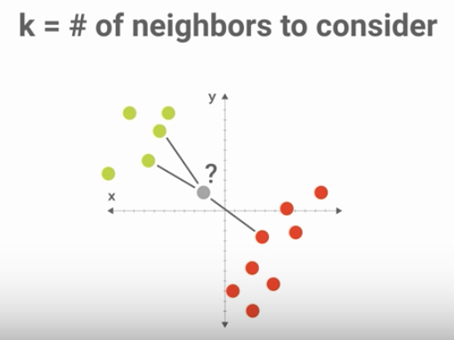

Let's use the idea of utilizing the color of the nearest neighbor, or neighbors, to determine the color.
... use the formula for euclidean distance to find the nearest neighbor.

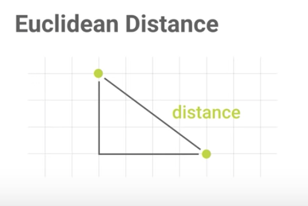
The distance that we compute is just the length of the hypotenuse.

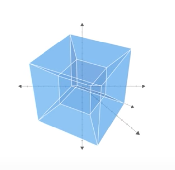

If we have 4 or more features, we have a hybrid cube and visualization becomes difficult, but the Euclidean distance works in the same way.


```python
# Previously we imported the classifier from a library.
# ... this time, we will write our own.

from scipy.spatial import distance

# a=trainingPoint & b=testingPoint
def euc(a,b):
    return distance.euclidean(a,b)

# Implement a class for our classifier:
class ScrappyKNN():
    def fit(self, X_train, y_train):
        # Store the training data in this class
        self.X_train = X_train
        self.y_train = y_train
    
    def predict(self, X_test):
        predicitons = []
        for row in X_test:
            # Method to find the closest point
            label = self.closest(row)
            predictions.append(label)
        
        return predictions
    
    # Loop over all training points and keep track of nearest ones, so far
    def closest(self, row):
        #calc dist from train point to nearest test point
        best_dist = euc(row, self.X_train[0])
        # Keep track of index of closest point
        best_index = 0
        # Iterate over all other training points and update when you find a closer one
        for i in range(1, len(self.X_train)):
            dist = euc(row, self.X_train[i])
            if dist < best.dist:
                best_dist = dist
                # use index to return the closest point
                best_index = i
                
            return self.y_train[best_index]

# Import a dataset
from sklearn import datasets
iris = datasets.load_iris()

# Feature--> f(x)=y <--Label
X = iris.data
y = iris.target

# Import the data, then partition into 1. _train and 2. _test
from sklearn.model_selection import train_test_split
X_train, X_test, y_train, y_test = train_test_split(X, y, test_size = .5)

# Comment out our classifier and write our own...
# from sklearn.neighbors import KNeighborsClassifier

# Change our pipeline to use our new classifier
# my_classifier = KNeighborsClassifier()
my_classifier = ScrappyKNN()

# Use training data on classifier
my_classifier.fit(X_train, y_train)

# Use predict method to classify test data
# predictions = my_classifier.predict(X_test)
# print(predictions)

# To find accuracy, compare predicted labels to true values
from sklearn.metrics import accuracy_score
# In this case, accuracy should be ~%90
print(accuracy_score(y_test, predictions))
```

Pros:
    Simplicity
    
Cons:
    Computationally intensive
    Hard to represent relationships between features

---

----

----

# Deep Learning in Python with TensorFlow and Keras

<pre>First use the following command to install TensorFlow:
(note: You should be on TensorFlow v1.0 or newer)</pre>
> pip install --upgrade tensorflow


```python
# To determine which version of tensorflow you're using, run:
import tensorflow as tf

tf.__version__
```


    '1.13.1'


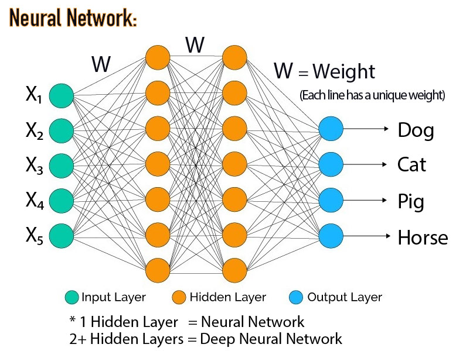


```python
import tensorflow as tf

# Import dataset
# mnist = 28x28 images of hand-written digits 0-9
mnist = tf.keras.datasets.mnist

# Unpack the dataset to training/testing variables
(x_train, y_train), (x_test, y_test) = mnist.load_data()
```


```python
import matplotlib.pyplot as plt

# plt.imshow(x_train[0])

# Will print out a multi-dimensional array: ie: a tensor
print(x_train[0])
```

    [[  0   0   0   0   0   0   0   0   0   0   0   0   0   0   0   0   0   0
        0   0   0   0   0   0   0   0   0   0]
     [  0   0   0   0   0   0   0   0   0   0   0   0   0   0   0   0   0   0
        0   0   0   0   0   0   0   0   0   0]
     [  0   0   0   0   0   0   0   0   0   0   0   0   0   0   0   0   0   0
        0   0   0   0   0   0   0   0   0   0]
     [  0   0   0   0   0   0   0   0   0   0   0   0   0   0   0   0   0   0
        0   0   0   0   0   0   0   0   0   0]
     [  0   0   0   0   0   0   0   0   0   0   0   0   0   0   0   0   0   0
        0   0   0   0   0   0   0   0   0   0]
     [  0   0   0   0   0   0   0   0   0   0   0   0   3  18  18  18 126 136
      175  26 166 255 247 127   0   0   0   0]
     [  0   0   0   0   0   0   0   0  30  36  94 154 170 253 253 253 253 253
      225 172 253 242 195  64   0   0   0   0]
     [  0   0   0   0   0   0   0  49 238 253 253 253 253 253 253 253 253 251
       93  82  82  56  39   0   0   0   0   0]
     [  0   0   0   0   0   0   0  18 219 253 253 253 253 253 198 182 247 241
        0   0   0   0   0   0   0   0   0   0]
     [  0   0   0   0   0   0   0   0  80 156 107 253 253 205  11   0  43 154
        0   0   0   0   0   0   0   0   0   0]
     [  0   0   0   0   0   0   0   0   0  14   1 154 253  90   0   0   0   0
        0   0   0   0   0   0   0   0   0   0]
     [  0   0   0   0   0   0   0   0   0   0   0 139 253 190   2   0   0   0
        0   0   0   0   0   0   0   0   0   0]
     [  0   0   0   0   0   0   0   0   0   0   0  11 190 253  70   0   0   0
        0   0   0   0   0   0   0   0   0   0]
     [  0   0   0   0   0   0   0   0   0   0   0   0  35 241 225 160 108   1
        0   0   0   0   0   0   0   0   0   0]
     [  0   0   0   0   0   0   0   0   0   0   0   0   0  81 240 253 253 119
       25   0   0   0   0   0   0   0   0   0]
     [  0   0   0   0   0   0   0   0   0   0   0   0   0   0  45 186 253 253
      150  27   0   0   0   0   0   0   0   0]
     [  0   0   0   0   0   0   0   0   0   0   0   0   0   0   0  16  93 252
      253 187   0   0   0   0   0   0   0   0]
     [  0   0   0   0   0   0   0   0   0   0   0   0   0   0   0   0   0 249
      253 249  64   0   0   0   0   0   0   0]
     [  0   0   0   0   0   0   0   0   0   0   0   0   0   0  46 130 183 253
      253 207   2   0   0   0   0   0   0   0]
     [  0   0   0   0   0   0   0   0   0   0   0   0  39 148 229 253 253 253
      250 182   0   0   0   0   0   0   0   0]
     [  0   0   0   0   0   0   0   0   0   0  24 114 221 253 253 253 253 201
       78   0   0   0   0   0   0   0   0   0]
     [  0   0   0   0   0   0   0   0  23  66 213 253 253 253 253 198  81   2
        0   0   0   0   0   0   0   0   0   0]
     [  0   0   0   0   0   0  18 171 219 253 253 253 253 195  80   9   0   0
        0   0   0   0   0   0   0   0   0   0]
     [  0   0   0   0  55 172 226 253 253 253 253 244 133  11   0   0   0   0
        0   0   0   0   0   0   0   0   0   0]
     [  0   0   0   0 136 253 253 253 212 135 132  16   0   0   0   0   0   0
        0   0   0   0   0   0   0   0   0   0]
     [  0   0   0   0   0   0   0   0   0   0   0   0   0   0   0   0   0   0
        0   0   0   0   0   0   0   0   0   0]
     [  0   0   0   0   0   0   0   0   0   0   0   0   0   0   0   0   0   0
        0   0   0   0   0   0   0   0   0   0]
     [  0   0   0   0   0   0   0   0   0   0   0   0   0   0   0   0   0   0
        0   0   0   0   0   0   0   0   0   0]]


```python
import matplotlib.pyplot as plt

# The output is not color, but it does appear to be, so use cmap...
plt.imshow(x_train[0])
plt.show()

# Use 'cmap' to set the color map = binary in this case:
plt.imshow(x_train[0], cmap = plt.cm.binary)
plt.show()

# Will print out a multi-dimensional array: ie: a tensor
# print(x_train[0])
```


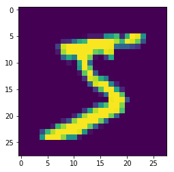


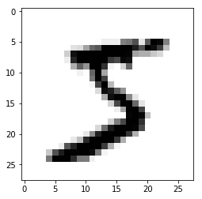


```python
import tensorflow as tf
import matplotlib.pyplot as plt

# Import dataset
# mnist = 28x28 images of hand-written digits 0-9
mnist = tf.keras.datasets.mnist

# Unpack the dataset to training/testing variables
(x_train, y_train), (x_test, y_test) = mnist.load_data()

# Normalize the data -- ie: Scale it
x_train = tf.keras.utils.normalize(x_train, axis=1)
x_test = tf.keras.utils.normalize(x_test, axis=1)

# Use 'cmap' to set the color map = binary in this case:
plt.imshow(x_train[0], cmap = plt.cm.binary)
plt.show()

# Print out values scaled from 0-1, instead of 0-255
print(x_train[0])
```


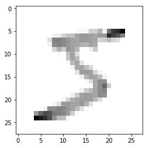


    [[0.         0.         0.         0.         0.         0.
      0.         0.         0.         0.         0.         0.
      0.         0.         0.         0.         0.         0.
      0.         0.         0.         0.         0.         0.
      0.         0.         0.         0.        ]
     [0.         0.         0.         0.         0.         0.
      0.         0.         0.         0.         0.         0.
      0.         0.         0.         0.         0.         0.
      0.         0.         0.         0.         0.         0.
      0.         0.         0.         0.        ]
     [0.         0.         0.         0.         0.         0.
      0.         0.         0.         0.         0.         0.
      0.         0.         0.         0.         0.         0.
      0.         0.         0.         0.         0.         0.
      0.         0.         0.         0.        ]
     [0.         0.         0.         0.         0.         0.
      0.         0.         0.         0.         0.         0.
      0.         0.         0.         0.         0.         0.
      0.         0.         0.         0.         0.         0.
      0.         0.         0.         0.        ]
     [0.         0.         0.         0.         0.         0.
      0.         0.         0.         0.         0.         0.
      0.         0.         0.         0.         0.         0.
      0.         0.         0.         0.         0.         0.
      0.         0.         0.         0.        ]
     [0.         0.         0.         0.         0.         0.
      0.         0.         0.         0.         0.         0.
      0.00393124 0.02332955 0.02620568 0.02625207 0.17420356 0.17566281
      0.28629534 0.05664824 0.51877786 0.71632322 0.77892406 0.89301644
      0.         0.         0.         0.        ]
     [0.         0.         0.         0.         0.         0.
      0.         0.         0.05780486 0.06524513 0.16128198 0.22713296
      0.22277047 0.32790981 0.36833534 0.3689874  0.34978968 0.32678448
      0.368094   0.3747499  0.79066747 0.67980478 0.61494005 0.45002403
      0.         0.         0.         0.        ]
     [0.         0.         0.         0.         0.         0.
      0.         0.12250613 0.45858525 0.45852825 0.43408872 0.37314701
      0.33153488 0.32790981 0.36833534 0.3689874  0.34978968 0.32420121
      0.15214552 0.17865984 0.25626376 0.1573102  0.12298801 0.
      0.         0.         0.         0.        ]
     [0.         0.         0.         0.         0.         0.
      0.         0.04500225 0.4219755  0.45852825 0.43408872 0.37314701
      0.33153488 0.32790981 0.28826244 0.26543758 0.34149427 0.31128482
      0.         0.         0.         0.         0.         0.
      0.         0.         0.         0.        ]
     [0.         0.         0.         0.         0.         0.
      0.         0.         0.1541463  0.28272888 0.18358693 0.37314701
      0.33153488 0.26569767 0.01601458 0.         0.05945042 0.19891229
      0.         0.         0.         0.         0.         0.
      0.         0.         0.         0.        ]
     [0.         0.         0.         0.         0.         0.
      0.         0.         0.         0.0253731  0.00171577 0.22713296
      0.33153488 0.11664776 0.         0.         0.         0.
      0.         0.         0.         0.         0.         0.
      0.         0.         0.         0.        ]
     [0.         0.         0.         0.         0.         0.
      0.         0.         0.         0.         0.         0.20500962
      0.33153488 0.24625638 0.00291174 0.         0.         0.
      0.         0.         0.         0.         0.         0.
      0.         0.         0.         0.        ]
     [0.         0.         0.         0.         0.         0.
      0.         0.         0.         0.         0.         0.01622378
      0.24897876 0.32790981 0.10191096 0.         0.         0.
      0.         0.         0.         0.         0.         0.
      0.         0.         0.         0.        ]
     [0.         0.         0.         0.         0.         0.
      0.         0.         0.         0.         0.         0.
      0.04586451 0.31235677 0.32757096 0.23335172 0.14931733 0.00129164
      0.         0.         0.         0.         0.         0.
      0.         0.         0.         0.        ]
     [0.         0.         0.         0.         0.         0.
      0.         0.         0.         0.         0.         0.
      0.         0.10498298 0.34940902 0.3689874  0.34978968 0.15370495
      0.04089933 0.         0.         0.         0.         0.
      0.         0.         0.         0.        ]
     [0.         0.         0.         0.         0.         0.
      0.         0.         0.         0.         0.         0.
      0.         0.         0.06551419 0.27127137 0.34978968 0.32678448
      0.245396   0.05882702 0.         0.         0.         0.
      0.         0.         0.         0.        ]
     [0.         0.         0.         0.         0.         0.
      0.         0.         0.         0.         0.         0.
      0.         0.         0.         0.02333517 0.12857881 0.32549285
      0.41390126 0.40743158 0.         0.         0.         0.
      0.         0.         0.         0.        ]
     [0.         0.         0.         0.         0.         0.
      0.         0.         0.         0.         0.         0.
      0.         0.         0.         0.         0.         0.32161793
      0.41390126 0.54251585 0.20001074 0.         0.         0.
      0.         0.         0.         0.        ]
     [0.         0.         0.         0.         0.         0.
      0.         0.         0.         0.         0.         0.
      0.         0.         0.06697006 0.18959827 0.25300993 0.32678448
      0.41390126 0.45100715 0.00625034 0.         0.         0.
      0.         0.         0.         0.        ]
     [0.         0.         0.         0.         0.         0.
      0.         0.         0.         0.         0.         0.
      0.05110617 0.19182076 0.33339444 0.3689874  0.34978968 0.32678448
      0.40899334 0.39653769 0.         0.         0.         0.
      0.         0.         0.         0.        ]
     [0.         0.         0.         0.         0.         0.
      0.         0.         0.         0.         0.04117838 0.16813739
      0.28960162 0.32790981 0.36833534 0.3689874  0.34978968 0.25961929
      0.12760592 0.         0.         0.         0.         0.
      0.         0.         0.         0.        ]
     [0.         0.         0.         0.         0.         0.
      0.         0.         0.04431706 0.11961607 0.36545809 0.37314701
      0.33153488 0.32790981 0.36833534 0.28877275 0.111988   0.00258328
      0.         0.         0.         0.         0.         0.
      0.         0.         0.         0.        ]
     [0.         0.         0.         0.         0.         0.
      0.05298497 0.42752138 0.4219755  0.45852825 0.43408872 0.37314701
      0.33153488 0.25273681 0.11646967 0.01312603 0.         0.
      0.         0.         0.         0.         0.         0.
      0.         0.         0.         0.        ]
     [0.         0.         0.         0.         0.37491383 0.56222061
      0.66525569 0.63253163 0.48748768 0.45852825 0.43408872 0.359873
      0.17428513 0.01425695 0.         0.         0.         0.
      0.         0.         0.         0.         0.         0.
      0.         0.         0.         0.        ]
     [0.         0.         0.         0.         0.92705966 0.82698729
      0.74473314 0.63253163 0.4084877  0.24466922 0.22648107 0.02359823
      0.         0.         0.         0.         0.         0.
      0.         0.         0.         0.         0.         0.
      0.         0.         0.         0.        ]
     [0.         0.         0.         0.         0.         0.
      0.         0.         0.         0.         0.         0.
      0.         0.         0.         0.         0.         0.
      0.         0.         0.         0.         0.         0.
      0.         0.         0.         0.        ]
     [0.         0.         0.         0.         0.         0.
      0.         0.         0.         0.         0.         0.
      0.         0.         0.         0.         0.         0.
      0.         0.         0.         0.         0.         0.
      0.         0.         0.         0.        ]
     [0.         0.         0.         0.         0.         0.
      0.         0.         0.         0.         0.         0.
      0.         0.         0.         0.         0.         0.
      0.         0.         0.         0.         0.         0.
      0.         0.         0.         0.        ]]


```python
import tensorflow as tf
import matplotlib.pyplot as plt

# Import dataset
# mnist = 28x28 images of hand-written digits 0-9
mnist = tf.keras.datasets.mnist

# Unpack the dataset to training/testing variables
(x_train, y_train), (x_test, y_test) = mnist.load_data()

# Normalize the data -- ie: Scale it
x_train = tf.keras.utils.normalize(x_train, axis=1)
x_test = tf.keras.utils.normalize(x_test, axis=1)

# Build the model -- Sequential model in this case
model = tf.keras.models.Sequential()
# First layer, is the input layer
model.add(tf.keras.layers.Flatten())

#### Defining the architecture of the model
# 2 Hidden Layers -- 128 neurons in the layer
# activation function = ie: What will make that neuron fire?
model.add(tf.keras.layers.Dense(128, activation=tf.nn.relu))
model.add(tf.keras.layers.Dense(128, activation=tf.nn.relu))
# Output Layer: Contains # of classifications
# Use softmax for a probability distribution
model.add(tf.keras.layers.Dense(10, activation=tf.nn.softmax))

# Define parameters for training of the model
model.compile(optimizer='adam',
              # loss = degree of error
              # NN doesn't optimize accuracy, it minimizes loss
             loss='sparse_categorical_crossentropy',
             metrics=['accuracy'])

# To train the model:
model.fit(x_train, y_train, epochs=3)

# *You should expect about 97% accuracy after 3 epochs
```

    WARNING:tensorflow:From /Users/farnamadelkhani/anaconda3/lib/python3.7/site-packages/tensorflow/python/ops/resource_variable_ops.py:435: colocate_with (from tensorflow.python.framework.ops) is deprecated and will be removed in a future version.
    Instructions for updating:
    Colocations handled automatically by placer.
    Epoch 1/3
    60000/60000 [==============================] - 4s 62us/sample - loss: 0.2630 - acc: 0.9242
    Epoch 2/3
    60000/60000 [==============================] - 3s 57us/sample - loss: 0.1081 - acc: 0.9661
    Epoch 3/3
    60000/60000 [==============================] - 4s 59us/sample - loss: 0.0737 - acc: 0.9764


    <tensorflow.python.keras.callbacks.History at 0xb2ea6cfd0>


```python
# Calculate the validation loss and validation accuracy
val_loss, val_acc = model.evaluate(x_test, y_test)

print(val_loss, val_acc)

# Should expect something close to: loss: 0.0987493448088877 acc: 0.9694
```

    10000/10000 [==============================] - 0s 28us/sample - loss: 0.0985 - acc: 0.9709
    0.09853081665905193 0.9709


```python
# To save a model: 
model.save('epic_num_reader.model')
```


```python
# To load a model:
new_model = tf.keras.models.load_model('epic_num_reader.model')
```

    WARNING:tensorflow:Sequential models without an `input_shape` passed to the first layer cannot reload their optimizer state. As a result, your model isstarting with a freshly initialized optimizer.


```python
# Keep in mind that predict always takes a list:
predictions = new_model.predict(x_test)
```


```python
# These are the probability distributions
print(predictions)
```

    [[2.20791847e-08 3.71182892e-07 9.36491574e-07 ... 9.99907613e-01
      4.70785047e-08 1.60606902e-07]
     [2.18196146e-08 1.94961089e-04 9.99676466e-01 ... 1.24580235e-09
      2.16386780e-07 1.67076509e-11]
     [1.96304040e-09 9.99961376e-01 1.85025200e-07 ... 1.91777344e-05
      1.30230555e-05 2.08777536e-07]
     ...
     [1.08659400e-07 2.16084300e-05 3.73443527e-07 ... 5.25834621e-04
      3.55844822e-05 8.75141486e-05]
     [2.49619319e-07 1.92701293e-07 6.11676176e-09 ... 1.09924351e-07
      1.98215232e-04 1.21782824e-08]
     [1.10240517e-05 1.41314349e-09 8.46450092e-08 ... 9.45237333e-10
      7.46150519e-09 5.61831541e-08]]


```python
import numpy as np

print(np.argmax(predictions[0]))

# Should predict a '7'
```

    7


```python
plt.imshow(x_test[0])
plt.show()

# Should display a '7'
```


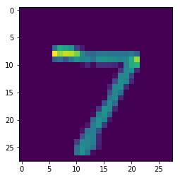


```python

```